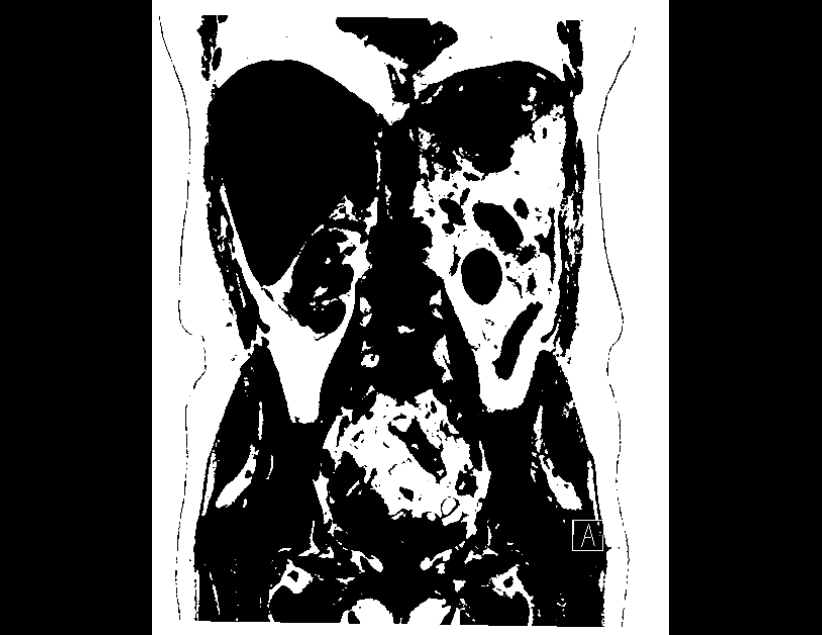
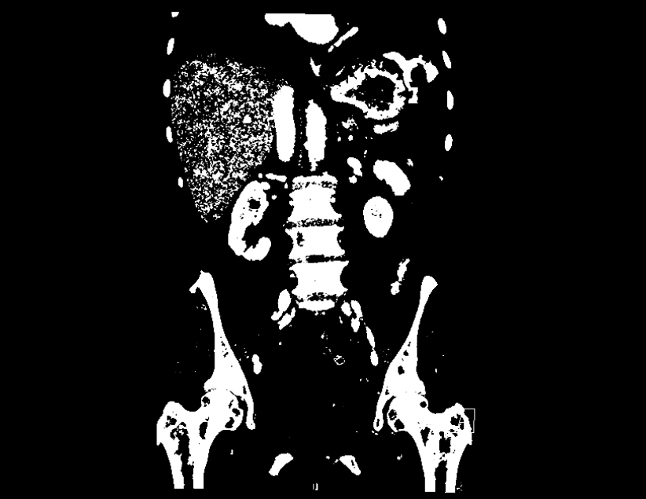
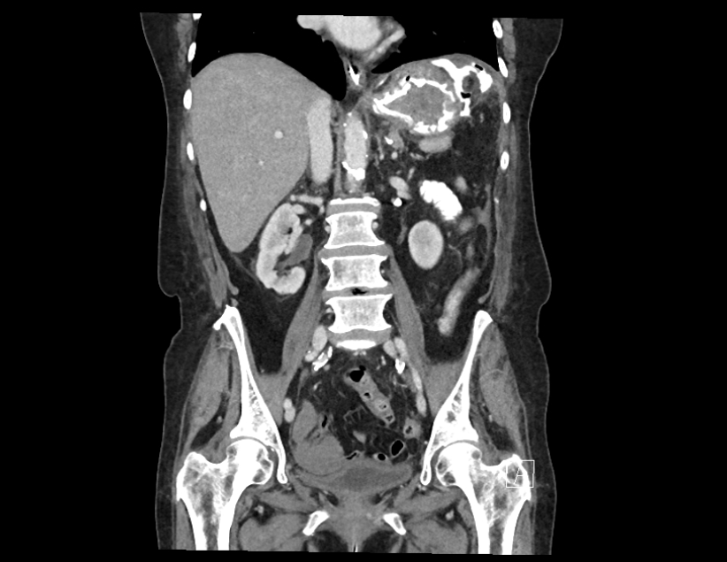
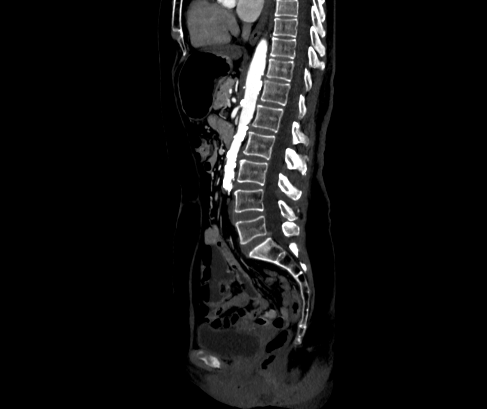
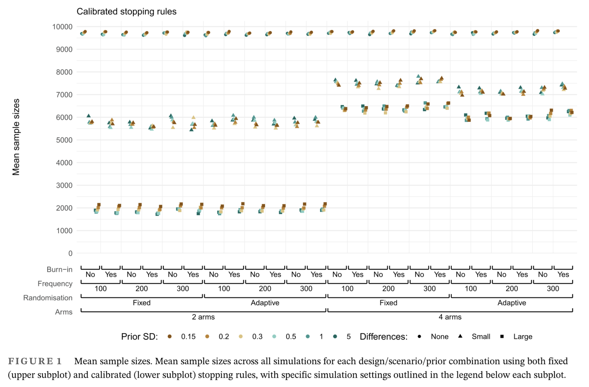
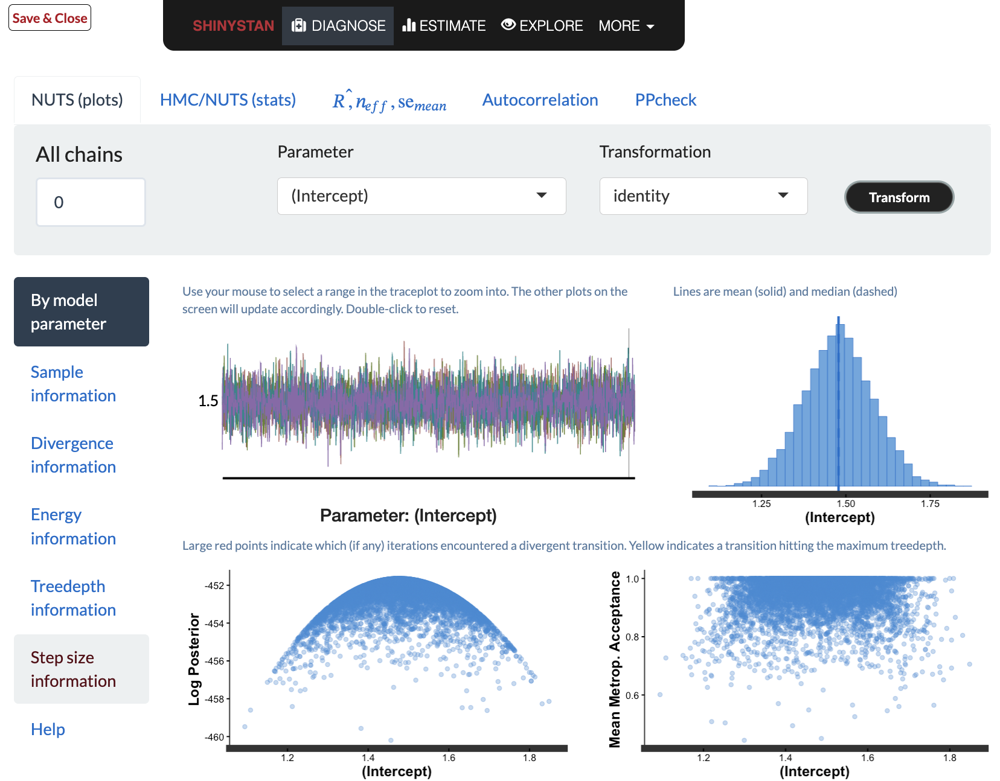
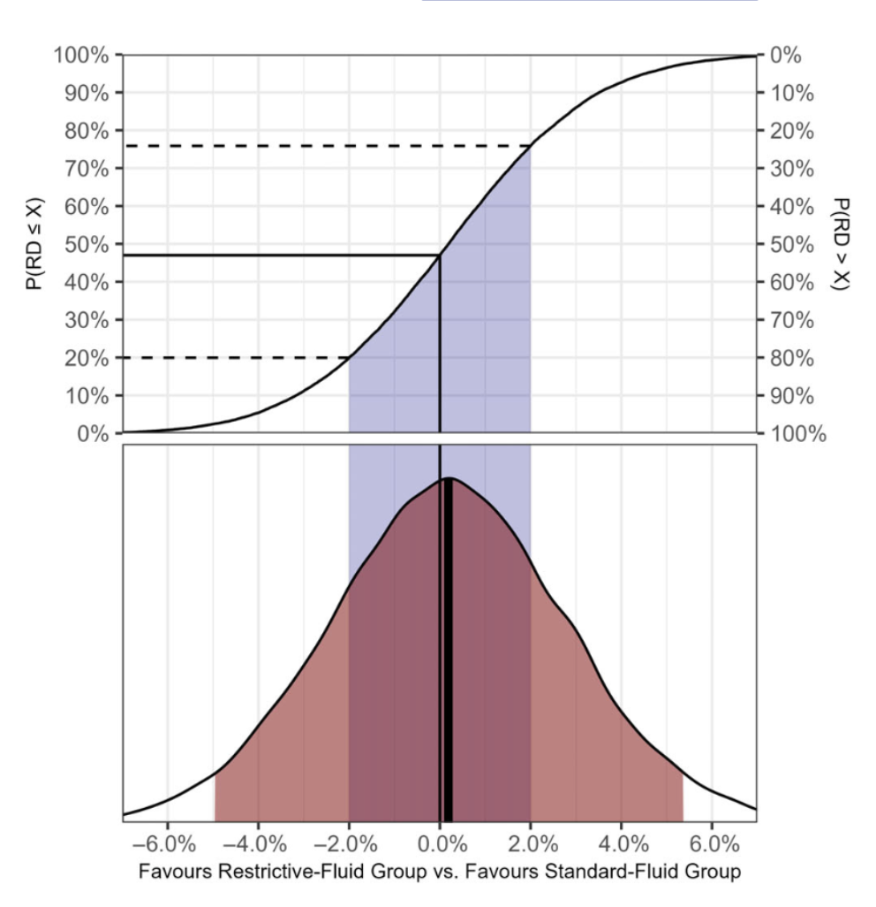

```{r warning=FALSE, message=FALSE}
library(ggplot2)
library(patchwork)
library(dplyr)
library(tidyr)
library(readr)
library(purrr)
library(rstanarm)
library(coda)
library(adaptr)
library(bayesplot)

presentation_theme <- theme_minimal()
theme_set(presentation_theme)

options(mc.cores = 4)
```


# Decision problems {.center}

{fig-align="center"}

## {.center}

::: notes
Snatched from Drummond with some changes
:::

The Bayesian approach is tailored to decision making.

Designing an epidemiological study or clinical trial is a decision problem.

Drawing a conclusion from a study or trial (...) is a decision problem.

Allocating resources among various research projects is a decision problem.

Stopping drug and biotech development is a decision problem.

Changing clinical practice is a decision problem.

## Scientific questions {.center}

How many new CT scans are done on a given day?

How much time is spent on interpreting and reporting normal CTs every week?

What proportion of CT urographies might be spared if patients in standardised cancer pathways were seen in the ambulatory first?

In what patients are newer, more advanced CT scans worthwhile?

Which follow-up strategy is superior for patients with incidental findings in the lungs?


## Learning objectives {.center}

No longer fear Bayesian analyses

Describe the five steps of a Bayesian data analysis

Express priors for linear and logistic regressions

Carry out a basic Bayesian regression analysis in R

## Me {.center}

::: notes
Sorry about my examples from radiology
:::

Resident in radiology

MD, MSc epi & biostats, PhD biostats & bioinformatics, postdoc-ish

Big secondary data sets for several kinds of epi endeavours

Adaptive platform trial design (methods and data)

Co-creator of EasyRF and adaptr

## A thousand shades of grey

::: {.r-stack}

{fig-align="center" .fragment}

{fig-align="center" .fragment}

{fig-align="center" .fragment}

{fig-align="center" .fragment}

:::


## A formalism for human intuition {.center}

$P(\theta | D) \propto P(D | \theta) \times P(\theta)$

posterior $\propto$ likelihood $\times$ prior\
\
Start with a belief about something

Observe the world to learn something new

Update your belief in light of these new observations\
\
We make probability statements about model parameters

Derived quantities follow directly (as we'll see)

# 5 steps in a Bayesian analysis

-   Design phase
    1.  Characterise data

    2.  Define appropriate data model

    3.  Specify priors
-   Analysis
    4.  Update parameters in light of new data

    5.  Diagnostics (convergence and posterior predictive checks)

BARG is a great first resource (10.1038/s41562-021-01177-7)

# 1. Characterise data (outcome)

-   Numeric (interval, ratio, discrete) - Normal, log-Normal, Poisson
-   Binary - binomial
-   Time to event - survival analysis
-   Categorical or ordinal - multinomial
-   Other type (e.g. per 1,000 patienter or per day) - offset Poisson

# 2. Appropriate data model

## Example

-   RCT with 2 arms

-   We're interested in the probability of death (= mortality risk) $\theta$ in each arm

-   Count outcome =\> Binomial likelihood

-   Outcomes across patients assumed independent

|           |                 New                  |               Standard               |
|------------------|:--------------------------:|:------------------------:|
| Deaths    |            $z_\text{covered}$            |           $z_\text{bare}$            |
| Survivors |            $N_\text{covered} - z_\text{covered}$            |           $N_\text{bare} - z_\text{bare}$            |
| Risk      | $\frac{z_\text{covered}}{N_\text{covered}}$ | $\frac{z_\text{bare}}{N_\text{bare}}$ |

## The binomial model {.center}

-   $N$ independent trials (e.g. in each arm if RCT)

    -   Called Bernoulli model if $N = 1$

-   Two possible outcomes: success (1) and failure (0)

-   $z$ is the number of successes observed

-   Each trial has the same probability of success = $\theta$

    -   The parameter to be estimated

## Estimation {.center}

-   Conjugate analysis
    -   Simple, neat and (mostly) inadequate
    -   Not for regression analyses
-   Sampling (modern)
    -   Simple: naive and inefficeient (but correct)
    -   Markov chain Monte Carlo (MCMC): efficient and fairly easy

## Conjugate analysis {.center}

-   The posterior distribution is the same type as the prior
-   Over-simplistic for any realistic analysis
    -   Trials should also adjust for baseline variables
-   Beta-Binomial example:
    -   Prior: $\theta_\text{prior} \sim$ Beta($\alpha$, $\beta$)
        -   Think of $\alpha$ and $\beta$ as the numbers with and without the event
    -   Likelihood: $z \sim$ Binomial($N$, $\theta_\text{prior}$)
        -   $z$ and $N$ are observed data points
    -   Posterior: $\theta_\text{posterior} \sim$ Beta($\alpha + z$, $\beta + N - z$)

# 3. Devising priors

... and they could have any shape

## Sources {.center}

-   Non-informative priors *don't* exist
    -   Even entirely uniform priors carry information about your expectations
    -   Uniform priors are implicit in frequentist results
-   Published results (RCTs, observational studies)
-   Domain experts
-   Regularisation of estimates
    -   Logical conclusions (RR \> 10 *very* unlikely)
    -   Laplace prior => lasso regression
    -   Narrow Gaussian prior => ridge regression

## Example: CMI, stents and mortality {.center}

::: panel-tabset

### CT

{fig-align="center"}

### Setting

-   Let's design a new trial
-   Effect of covered stents on 60-day mortality in patients with chronic mesenteric ischaemia
-   2 arms: covered vs. bare-metal stents
-   10-100 patients in each arm
-   How many die in each arm?
-   Ask 5 colleagues with lots of domain knowledge in this area:

```{r}
#| echo: true

z_covered <- c(20, 10, 50, 20, 5) # no. deaths in covered stent arm
n_covered <- c(100, 100, 100, 50, 10) # no. survivors in covered stent arm
z_bare <- c(40, 20, 50, 30, 4) # no. deaths in bare-metal arm
n_bare <- c(100, 100, 100, 50, 9) # no. survivors in bare-metal arm

a_covered <- round(mean(z_covered / n_covered * 100)) # 34
a_bare <- round(mean(z_bare / n_bare * 100)) # 43
```

### Priors

```{r}
#| echo: false
beta_df <- function(a, n, g, k = 0, theta_grid = 0:500/500) {
  tibble(
    theta = theta_grid,
    dens = dbeta(theta_grid, a, n - a),
    group = g,
    k = k
  )
}

df_covered <- df_bare <- list()
for (i in seq(z_covered)) {
  df_covered[[i]] <- beta_df(z_covered[i], "Covered", i, n = n_covered[i])
  df_bare[[i]] <- beta_df(z_bare[i], "Bare-metal", i, n = n_bare[i])
}
combined_df <- bind_rows(
  beta_df(a_covered, 100, "Covered"),
  beta_df(a_bare, 100, "Bare-metal")
)

mutate(bind_rows(df_covered, df_bare), k = as.character(k)) %>%
  ggplot(aes(x = theta, y = dens)) +
    geom_area(data = combined_df, alpha = 0.2, position = "identity") +
    geom_line(aes(colour = k), show.legend = FALSE) +
    facet_wrap(~ group, ncol = 1) +
    scale_color_brewer(palette = "Set2") +
    labs(x = "Mortality risk", title = "Priors for new trial")
```

### Derived quantities
```{r}
#| echo: true
derived_quantities <- tibble(
  risk_covered = rbeta(1000, a_covered, 100 - a_covered),
  risk_bare = rbeta(1000, a_bare, 100 - a_bare),
  risk_ratio = risk_covered / risk_bare
)

derived_quantities
```

### Prior pred. check
```{r}
p1 <- ggplot(derived_quantities, aes(x = risk_ratio)) +
  stat_density(geom = "line") +
  geom_vline(xintercept = 1, linetype = 2) +
  scale_x_log10() +
  labs(x = "Risk ratio (log scale)", y = NULL, title = "Density") +
  theme(axis.text.y = element_blank())

p2 <- ggplot(derived_quantities, aes(x = risk_ratio)) +
  stat_ecdf(geom = "line") +
  geom_hline(yintercept = c(0.025, 0.975), linetype = 2) +
  labs(y = NULL, title = "Cumulative density")

p1 + p2
```

:::

## Prior in conjugate binary analysis {.nostretch}

Beta distribution obvious choice: flexible and easy to intuit. Dirichlet for multinomial distribution.

::: panel-tabset
### Parameters

Expecting 30% proportion in a certain group

And the lower bound of the 95% CrI lying at 10%

What't the corresponding beta prior?

```{r}
#| echo: true
library(adaptr)
find_beta_params(theta = 0.3, boundary_target = 0.1, n_dec = 0)
find_beta_params(theta = 0.3, boundary_target = 0.1, n_dec = 3)
```

### Plot {.scrollable}

```{r}
#| echo: true
ggplot() +
  stat_function(aes(colour = "Entire"), fun = ~ dbeta(., 4, 10)) +
  stat_function(aes(colour = "Decimal"), fun = ~ dbeta(., 4.204, 9.809))
```

:::

## Priors in logistic regression

::: panel-tabset

### Basics

Recall that coefficients in logistic regressions are on the log-OR scale

So how do we express meaningful and realistic priors for such coefficients?

For a 2x2 table we have that the approximate SD of the log-OR is given by,

$\qquad \sigma = \sqrt{\frac{1}{z_0} + \frac{1}{N_0 - z_0} + \frac{1}{z_1} + \frac{1}{N_1 - z_1}}$

### Informative priors

We can just plug in the "crowd-sourced" numbers from before:

$\qquad \log \text{OR}_\text{informative} = \log \left ( \frac{\frac{34}{100 - 34}}{\frac{43}{100 - 43}} \right ) = \log 0.682 = 2.83$

and

$\qquad \sigma_\text{informative} = \sqrt{\frac{1}{34} + \frac{1}{100 - 34} + \frac{1}{43} + \frac{1}{100 - 43}} = 0.29$

### Sceptical priors {.scrollable}

Imagine a corresponding trial that suggests no difference with 1:1 randomisation

Easy to specify a standard deviation $\sigma$ for a prior to express *no difference* in a trial with a certain event proportion $r$ and of a certain size $N = N_0 + N_1$,

$\qquad z_0 = z_1 = \tfrac{1}{2} N r$

$\qquad N_0 - z_0 = N_1 - z_1 = \tfrac{1}{2} N (1-r)$

So,

$\qquad  \log \text{OR}_\text{sceptic} = 0$

$\qquad \sigma_\text{sceptic} = \sqrt{\frac{4}{N (1-r)} + \frac{4}{Nr}}$

:::

## Priors in linear regression

::: panel-tabset

```{r}
#| echo: false
crowd_sourced_values <- list()
set.seed(2026)
for (i in LETTERS[1:10]) {
  crowd_sourced_values[[i]] <- tibble(
    grp = i,
    x = round(rnorm(20, 5, 2))
  )
}
crowd_sourced_values <- bind_rows(crowd_sourced_values)
```

### Separate

```{r}
ggplot() +
  geom_bar(aes(x = x, fill = grp), crowd_sourced_values, position = "dodge")
```

### Together

```{r}
ggplot() +
  geom_bar(aes(x = x, fill = grp), crowd_sourced_values, position = "stack")
```

### With prior
```{r}
(mu <- mean(crowd_sourced_values$x))
(sigma <- sd(crowd_sourced_values$x))
```

```{r}
ggplot() +
  geom_bar(aes(x = x, fill = grp), crowd_sourced_values, position = "stack") +
  geom_density(aes(x = rnorm(nrow(crowd_sourced_values), mu, sigma), y = after_stat(count)))
```

:::

# 4. Update parameters in light of data

## Conjugate analysis for binary outcome {.nostretch .scrollable}

Remember: $\theta_\text{posterior} \sim$ Beta($\alpha + z$, $\beta + N - z$)

::: panel-tabset

### Data {.scrollable}
```{r}
#| echo: true
cmi <- read_tsv(
  "data/cmi.tsv",
  col_types = cols(
    id = col_double(),
    treatment = col_factor(),
    age = col_double(),
    woman = col_factor(),
    sepsis = col_factor(),
    icu_los = col_double(),
    hosp_los = col_double(),
    dead_at_90_days = col_factor()
  )
)

summary(cmi)
```

### Fit {.scrollable}
```{r}
z_covered_observed <- sum(cmi$dead_at_90_days[cmi$treatment == 1] == 1)
z_bare_observed <- sum(cmi$dead_at_90_days[cmi$treatment == 0] == 1)

n_covered_observed <- sum(cmi$treatment == 1)
n_bare_observed <- sum(cmi$treatment == 0)

samples <- tibble(
  risk_covered_prior = rbeta(10000, a_covered, 100 - a_covered),
  risk_covered_posterior = rbeta(10000, a_covered + z_covered_observed, 100 - a_covered + n_covered_observed - z_covered_observed),
  risk_bare_prior = rbeta(10000, a_bare, 100 - a_bare),
  risk_bare_posterior = rbeta(10000, a_bare + z_bare_observed, 100 - a_bare + n_bare_observed - z_bare_observed),
  rr_prior = risk_covered_prior / risk_bare_prior,
  rr_posterior = risk_covered_posterior / risk_bare_posterior
)

ggplot(samples) +
  geom_density(aes(x = risk_covered_prior, colour = "Prior", linetype = "Covered")) +
  geom_density(aes(x = risk_covered_posterior, colour = "Posterior", linetype = "Covered")) +
  geom_density(aes(x = risk_bare_prior, colour = "Prior", linetype = "Bare")) +
  geom_density(aes(x = risk_bare_posterior, colour = "Posterior", linetype = "Bare")) +
  labs(y = NULL, x = "Risk")

ggplot(samples) +
  geom_density(aes(x = rr_prior, colour = "Prior")) +
  geom_density(aes(x = rr_posterior, colour = "Posterior")) +
  labs(x = "RR", y = NULL) +
  scale_x_log10()

```

### Simulation

User `adaptr`



:::

## Logistic regression with rstanarm {.scrollable}

::: panel-tabset

### Fitting {.scrollable}

```{r}
#| echo: true
r <- 0.2

sceptical_prior <- normal(
  location = 0, scale = sqrt(4/(1000 * (1 - r)) + 4/1000/r)
)

f_sceptical <- stan_glm(
  dead_at_90_days ~ treatment,
  family = binomial(),
  prior = sceptical_prior,
  data = cmi,
  chains = 4,
  cores = 1,
  seed = 2026,
  iter = 4000,
  refresh = 0 # to suppress verbose output
)

summary(f_sceptical, probs = c(0.025, 0.5, 0.975))

prior_summary(f_sceptical)
```

Default weak priors: $N(0, 2.5)$ for the intercept and $N(0, 0.16)$ as we specified.

### Estimates

```{r}
#| echo: true
exp(coef(f_sceptical))
exp(posterior_interval(f_sceptical, prob = 0.95))

curious_prior <- normal(
  location = 0, scale = sqrt(4/(100 * (1 - r)) + 4/100/r)
)
f_curious <- update(f_sceptical, prior = curious_prior)

exp(coef(f_curious))
exp(posterior_interval(f_curious, prob = 0.95))
```

```{r}
#| echo: true
posterior <- as.matrix(f_sceptical)
head(posterior)
mcmc_areas(posterior, pars = "treatment1", prob = 0.95, transformations = "exp")
```

### Posterior PD {.scrollable}

```{r}
#| echo: true
post_samples <- rowMeans(posterior_predict(f_sceptical, draws = 1000))
cri <- quantile(post_samples, c(0.025, 0.975))

with(density(post_samples), tibble(x, dens = y)) %>%
  mutate(in_95cri = between(x, cri[1], cri[2])) |>
  ggplot(aes(x = x, y = dens)) +
    geom_line(colour = "red") +
    geom_area(aes(fill = "95% CrI"), ~ filter(., in_95cri), alpha = 0.2) +
    geom_vline(xintercept = mean(0 == cmi$dead_at_90_days))
```

### Prior PD

```{r}
#| echo: true
prior_samples <- update(f_sceptical, prior_PD = TRUE, refresh = 0)
mcmc_areas(prior_samples, pars = "treatment1", transformations = "exp") +
  scale_x_log10()
```

### Shinystan

```{r}
#| echo: true
#| eval: false
launch_shinystan(f_sceptical)
```



### CLASSIC



:::

# 5. Model diagnostics and reporting

Probabilistic results and posterior draws are all conditional on the assumptions you put into the full model

No different from frequentist results

Because Bayesian analyses explicate these assumptions, these results tend to come across as more prone to the whim of the researcher

## Diagnostics briefly

::: {.panel-tabset}

### MCMC concepts

-   Chains: the number of Markov chains. Necessary to check convergence.
-   Iterations: the number of iterations for each chain (including warmup)
    - More iterations (= longer chains) yields more precise CrIs.
    - Usually better to increase number of chains as well
-   Warm-up: the number of warmup iterations per chain. Not part of the resulting posterior samples.
-   Thinning: a positive integer specifying the period for saving samples
    - Default is 1; uncommon with modern efficient MCMC methods
- Ascertain convergence *and* mixing of chains
- Any divergent transition renders the results invalid
    - Look at the `control` argument in `?rstan::stan`

### Rhat
```{r}
#| echo: true
rhat(f_sceptical)
```

### Density plots
```{r}
#| echo: true
mcmc_dens_overlay(f_sceptical)
```

### Trace plots
```{r}
#| echo: true
mcmc_trace(f_sceptical)
```

:::

# Take home

- Bayesian regression analyses almost as easy as frequentist ones
- Uninformative priors don't exist
- Use "equivalent RCT" to express priors in logistic regression
- Characterise data, appropriate data model, define priors, estimate posteriors, model diagnostics

# Thank you!

Benjamin Skov Kaas-Hansen

benskov@pm.me • github.com/epiben • linkedin.com/in/epiben

# Generating data

## CMI-DEATH {.scrollable}

```{r}
#| echo: true

expit <- function(x) exp(x) / (1 + exp(x))

N <- 1000
N_women <- 0.4 * N
N_men <- N - N_women
set.seed(2026)
tibble(
  id = seq_len(N),
  treatment = sample(0:1, N, replace = TRUE),
  age = round(runif(N, 18, 85)),
  woman = c(rep(1, N_women), rep(0, N_men)),
  sepsis = c(sample(0:1, N_women, TRUE, c(0.3, 0.7)), sample(0:1, N_men, TRUE)),
  icu_los = round(c(
    rlnorm(N_women, log(5 + sepsis), log(5)),
    rlnorm(N_men, log(7 + sepsis), log(4))
  ), 2),
  hosp_los = round(pmax(icu_los, icu_los * (3.5 + treatment + rnorm(N, 0, 0.5))), 2)
) %>%
  filter(icu_los < 365 | hosp_los < 365) %>%
  mutate(
    dead_at_90_days = 0L + (0.85 < expit(-20 - 0.8 * treatment + 0.3 * age - 0.2 * woman + 0.4 * sepsis))
  ) %>%
  # summarise(mean(dead_at_90_days))
  write_tsv("data/cmi.tsv")
```
